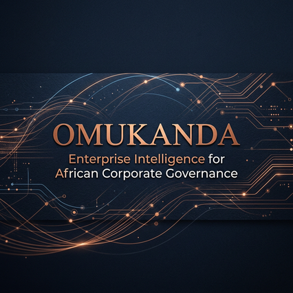
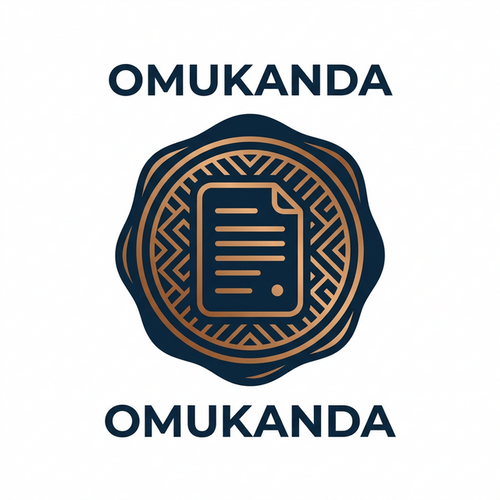

# Omukanda

### Enterprise Intelligence Operating System for African Corporate Governance

Omukanda is a distributed platform designed to bring mission-critical intelligence to African corporate governance. By combining real-time compliance tracking, AI-powered legal analysis, and automated regulatory monitoring, we provide the "Nervous System," "Brain," and "Muscle" for modern ventures.

---

## 🏗️ The Architecture

We approach system design as an integrated organism:

- **The Nervous System (Elixir/Phoenix)**: Real-time state management, event orchestration, and fault tolerance.
- **The Brain (Python/FastAPI)**: LLM orchestration, legal reasoning, and complex data embeddings.
- **The Muscle (Go)**: High-performance document processing, OCR, and regulatory data pipelines.

---

## 🌍 Our Mission

To empower African organizations with the tools they need to navigate complex regulatory landscapes with speed, accuracy, and integrity.

---

## 🚀 Key Features

- **Autonomous Compliance**: Real-time alerts and automated filing tracking.
- **Legal Intelligence**: Vector-based search for regional legal precedents and regulatory changes.
- **Venture Orchestration**: End-to-end lifecycle management for corporate entities.

---

  

